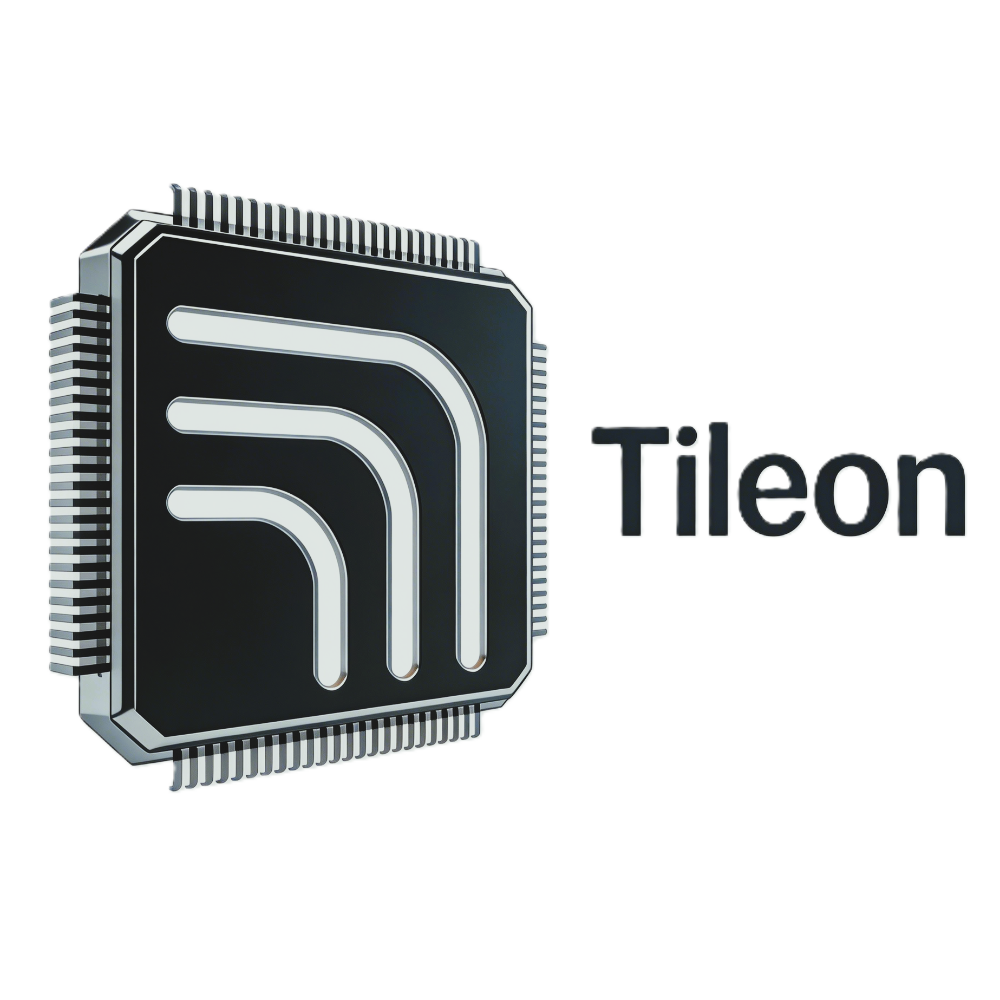

<div align="center">
    <p>
        
    </p>

<!-- Language Switch -->
<p>
    <a href="./README.md">
        
    </a>
    <a href="./docs/index.zh.md">
        
    </a>
</p>

<!-- Platform & Build -->
<p>
    
    
    
</p>

<!-- Package & Stats -->
<p>
    <a href="./LICENSE">
        
    </a>
    
    
</p>

<h3>
    <samp>A language and compiler for parallel programming<br>
    designed to simplify GPU kernel development through a Python-based DSL.</samp>
</h3>

<p>
    <a href="https://tensorplay.cn/tileon/"><strong>📚 Docs</strong></a> •
    <a href="#-quick-start"><strong>🚀 Quick Start</strong></a> •
    <a href="#-features"><strong>✨ Features</strong></a> •
    <a href="#-supported-operations"><strong>⚡ Operations</strong></a>
</p>
</div>

## ✨ Features

- **Python-based DSL**: Write GPU kernels using familiar Python syntax
- **Tile-based Programming Model**: Efficient parallel execution through tile-based computation
- **Just-in-Time Compilation**: Dynamic kernel compilation with the `@tileon.jit` decorator
- **Built-in Mathematical Operations**: Comprehensive math library (`tileon.language.math`)
- **Random Number Generation**: Philox-based RNG with `rand`, `randn`, and `randint` (`tileon.language.random`)
- **Automatic Parallelization**: Simple grid-based execution model
- **Interoperability**: Seamless integration with PyTorch tensors

## 🚀 Quick Install

```bash
git clone https://github.com/bluemoon-o2/tileon.git
cd tileon
pip install -e .
```

## ⚡ Quick Start

Here's a simple vector addition example:

```python
import torch
import tileon
import tileon.language as tl

DEVICE = torch.device("cpu")

@tileon.jit
def add_kernel(x_ptr, y_ptr, output_ptr, n_elements, BLOCK_SIZE: tl.constexpr):
    pid = tl.program_id(axis=0)
    block_start = pid * BLOCK_SIZE
    offsets = block_start + tl.arange(0, BLOCK_SIZE)
    mask = offsets < n_elements
    x = tl.load(x_ptr + offsets, mask=mask)
    y = tl.load(y_ptr + offsets, mask=mask)
    output = x + y
    tl.store(output_ptr + offsets, output, mask=mask)

def add(x: torch.Tensor, y: torch.Tensor):
    output = torch.empty_like(x)
    n_elements = output.numel()
    grid = lambda meta: (tileon.cdiv(n_elements, meta['BLOCK_SIZE']), )
    add_kernel[grid](x, y, output, n_elements, BLOCK_SIZE=1024)
    return output
```

## 📦 Supported Operations

### Linear Algebra
- **GEMM**: General Matrix Multiplication (`tl.dot`)
- **Vector Operations**: Element-wise addition, multiplication, etc.

### Neural Network Primitives
- **Softmax**: Row-wise softmax computation
- **Flash Attention**: Efficient attention mechanism
- **Block-Sparse Attention**: Sparse attention with custom block patterns

### Mathematical Functions
- **Arithmetic**: `add`, `sub`, `mul`, `div`, `fma`
- **Comparison**: `maximum`, `minimum`, `where`
- **Math**: `exp`, `log`, `sqrt`, `sin`, `cos`, `pow`
- **Reduction**: `sum`, `max`, `min`, `argmax`

### Random Number Generation
- **rand**: Uniform distribution [0, 1)
- **randn**: Normal distribution N(0, 1)
- **randint**: Integer random values

## 🏗️ Programming Model

### Kernel Definition

Use the `@tileon.jit` decorator to define kernels:

```python
@tileon.jit
def kernel_name(x_ptr, y_ptr, ..., BLOCK_SIZE: tl.constexpr):
    pid = tl.program_id(axis=0)
    offsets = pid * BLOCK_SIZE + tl.arange(0, BLOCK_SIZE)
    x = tl.load(x_ptr + offsets, mask=mask)
    y = x * 2
    tl.store(y_ptr + offsets, y, mask=mask)
```

### Execution

Launch kernels using grid specification:

```python
grid = lambda meta: (tileon.cdiv(N, meta['BLOCK_SIZE']), )
kernel[grid](x, y, BLOCK_SIZE=128)
```

## 🧪 Running Tests

```bash
# Run all tests
pytest tileon/test/ -v

# Run specific test file
pytest tileon/test/test_kernels.py -v

# Run benchmark
python tileon/test/test_kernels.py
```

## 📚 API Reference

### Core Functions
- `tileon.jit`: Decorator for JIT kernel compilation
- `tileon.cdiv`: Ceiling division
- `tileon.program_id`: Get current program ID
- `tileon.next_power_of_2`: Round up to next power of 2

### Tensor Operations (`tileon.language`)
- `tl.load`: Load data from memory
- `tl.store`: Store data to memory
- `tl.arange`: Create a range of indices
- `tl.dot`: Matrix multiplication

### Math Functions (`tileon.language.math`)
- `tl.exp`, `tl.log`, `tl.sqrt`
- `tl.sin`, `tl.cos`, `tl.pow`

### Random Functions (`tileon.language.random`)
- `tl_random.rand`: Uniform random [0, 1)
- `tl_random.randn`: Normal distribution N(0, 1)
- `tl_random.randint`: Integer random values

## 📄 License

Tileon is licensed under the MIT License. See [LICENSE](LICENSE.md) for more information.

## 🤝 Contributing

Contributions are welcome! Please see [CONTRIBUTING.md](CONTRIBUTING.md) for more information.

---

<div align="center">
    <sub>Built with ❤️ for the AI Learning Community • <a href="https://tensorplay.cn/tileon/">Tileon</a></sub>
</div>
